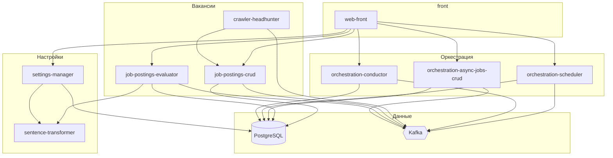

# specifications

Единый репозиторий **контрактов и постановок** для системы **joposcragent**: сбор вакансий с hh.ru, оценка релевантности, учёт асинхронных джобов и веб-интерфейс для настройки и просмотра результатов.

Исходный код сервисов, фронта и инфраструктуры живёт в отдельных репозиториях (`app/*`, `infra`, `solution`). Здесь — то, по чему их проектируют и сверяют при реализации: схема БД, OpenAPI, описания Kafka-сообщений и UI-экранов.

## Содержание репозитория

| Каталог | Назначение |
| ------- | ---------- |
| [database-schema/][db-schema] | SQL-миграции Flyway по схемам PostgreSQL |
| [messaging/][messaging] | Топики Kafka и структуры сообщений (OpenAPI YAML) |
| [services/][services] | Спецификации микросервисов: REST, Kafka, `openapi.yaml` |
| [front/][front] | Постановки экранов SPA (Vue 3) |

## Архитектура (логическая)

Планировщик и conductor запускают цепочки **collection-batch → collection-query → job-posting-create → job-posting-evaluate**; учёт джобов и связей с вакансиями и поисковыми запросами — в `orchestration-async-jobs-crud`.

## Микросервисы

| Сервис | Кратко | Точка входа в спецификации |
| ------ | ------ | -------------------------- |
| settings-manager | Эталонный контекст, поисковые запросы, шаблон промпта | [index.md][sm-index] |
| sentence-transformer | Векторизация текста и косинусная близость | [readme.md][st-readme] |
| job-postings-crud | CRUD вакансий, заметки, статусы, поиск | [index.md][jp-index] |
| job-postings-evaluator | Синхронная и асинхронная оценка релевантности | [readme.md][jpe-readme] |
| crawler-headhunter | Сбор с hh.ru (Playwright), REST и Kafka | [readme.md][hh-readme] |
| orchestration-scheduler | Cron-задачи, интервалы, ручной execute | [rest.md][sch-rest] |
| orchestration-conductor | Enqueue и консьюмеры пайплайна | [index.md][con-index] |
| orchestration-async-jobs-crud | REST учёта async jobs | [readme.md][aj-readme] |

OpenAPI каждого сервиса: `services/<имя-сервиса>/openapi.yaml`.

## База данных

Три схемы PostgreSQL в одной БД `joposcragent` (имя по умолчанию):

| Схема | Содержимое |
| ----- | ---------- |
| `settings` | Поисковые запросы, эталонный контекст, пороги, промпт |
| `job_postings` | Карточки вакансий, статусы оценки и отклика |
| `orchestration` | Async jobs, связи с вакансиями и запросами, планировщик |

Подробности, Docker Compose для локальных миграций и соглашения Flyway — в [database-schema/README.md][db-readme].

## Обмен сообщениями (Kafka)

Топики именуются как каталоги в [messaging/][messaging] (например `async-job.collection-query`). В каждом топике — YAML-файлы по **типу** сообщения (`*-begin`, `*-result`); общие фрагменты — в `common-*.yaml`.

| Топик | Назначение |
| ----- | ---------- |
| `async-job.collection-batch` | Пакетный запуск сбора по активным запросам |
| `async-job.collection-query` | Сбор по одному поисковому запросу |
| `async-job.job-posting-create` | Создание карточки вакансии в CRUD |
| `async-job.job-posting-evaluate` | Запуск оценки релевантности |

Правила ключей, заголовков (`type`, `createdAt`, `schemaVersion`) и тела — в [messaging/readme.md][msg-readme].

## Фронтенд

Спецификации UI для репозитория `web-front`: оболочка, дашборд, таблица вакансий, оркестратор, экраны настроек. Оглавление экранов, маршруты и переменные `VITE_*` — в [front/README.md][front-readme].

## Как пользоваться

1. **Новая фича API** — правки в `services/<сервис>/openapi.yaml` и при необходимости сопутствующие `.md`; затем регенерация клиентов/контроллеров в `app/<сервис>`.
2. **Новое сообщение Kafka** — YAML в `messaging/<топик>/`, при необходимости правка `common-*.yaml`; согласовать с [messaging/readme.md][msg-readme].
3. **Изменение БД** — миграция `database-schema/<схема>/V*__*.sql`; порядок схем — лексикографический по имени каталога.
4. **Новый экран** — каталог в `front/<экран>/README.md` и ссылка в [front/README.md][front-readme].

Спецификация считается источником истины: расхождения с кодом устраняют либо обновлением этого репозитория, либо приведением реализации к контракту — по договорённости в задаче.

## Связанные репозитории

| Репозиторий | Роль |
| ----------- | ---- |
| `app/settings-manager`, `app/job-postings-crud`, … | Реализация сервисов (Spring Boot / Node / Python) |
| `app/web-front` | SPA по спецификациям из `front/` |
| `infra` | Docker Compose, деплой, окружения |
| `solution` | Мета-репозиторий / workspace для разработки |

## Формат документов

- Markdown: [CommonMark][commonmark], проверка [markdownlint][markdownlint] (при наличии CLI).
- Внутренние ссылки в markdown — **reference-style** (определения в конце файла).
- REST и тела Kafka-сообщений — **OpenAPI 3** в YAML.

[db-schema]: database-schema/
[messaging]: messaging/
[services]: services/
[front]: front/
[db-readme]: database-schema/README.md
[msg-readme]: messaging/readme.md
[front-readme]: front/README.md
[sm-index]: services/settings-manager/index.md
[st-readme]: services/sentence-transformer/readme.md
[jp-index]: services/job-postings-crud/index.md
[jpe-readme]: services/job-postings-evaluator/readme.md
[hh-readme]: services/crawler-headhunter/readme.md
[sch-rest]: services/orchestration-scheduler/rest.md
[con-index]: services/orchestration-conductor/index.md
[aj-readme]: services/orchestration-async-jobs-crud/readme.md
[commonmark]: https://spec.commonmark.org/
[markdownlint]: https://github.com/DavidAnson/markdownlint
