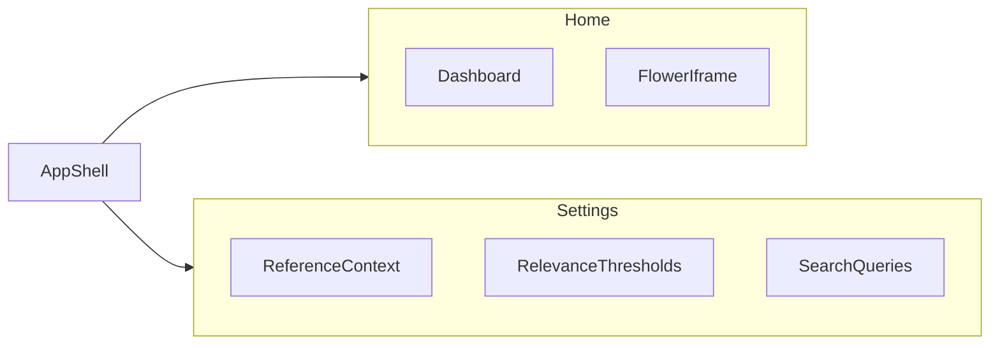

<!-- markdownlint-disable MD013 MD060 -->
# Спецификации UI (web-front)

Декомпозиция постановки на SPA (Vue 3, Vite, TypeScript, Pinia, axios, Material 3 / Vuetify 3) по экранам. Каждый экран — отдельный каталог с `README.md`: макет, алгоритмы элементов, сценарии при открытии и обновлении.

## Оглавление экранов

- [Оболочка приложения](app-shell/README.md) — split меню/контент (ширина и скрытие меню, резиновый контент), тема, базовые URL
- [Дашборд](dashboard/README.md) — релевантные вакансии в рассмотрении, таблица, инлайн-статусы
- [Оркестратор (Flower)](orchestrator-flower/README.md) — iframe в контенте, `VITE_FLOWER_BASE_URL`
- [Эталонный контекст](reference-context/README.md)
- [Пороги релевантности](relevance-thresholds/README.md)
- [Поисковые запросы](search-queries/README.md)

## Маршруты (логическая карта)

| Раздел меню | Подпункт | Документ |
|-------------|----------|----------|
| Главная | Дашборд (по умолчанию) | [dashboard/README.md](dashboard/README.md) |
| Главная | Оркестратор | [orchestrator-flower/README.md](orchestrator-flower/README.md) |
| Настройки | Эталонный контекст (по умолчанию) | [reference-context/README.md](reference-context/README.md) |
| Настройки | Пороги релевантности | [relevance-thresholds/README.md](relevance-thresholds/README.md) |
| Настройки | Поисковые запросы | [search-queries/README.md](search-queries/README.md) |

## Диаграмма навигации

## Переменные окружения фронта

Задаются в `.env` / сборке Vite (префикс `VITE_`).

| Переменная | Назначение |
|------------|------------|
| `VITE_SETTINGS_MANAGER_BASE_URL` | Базовый URL сервиса настроек |
| `VITE_JOB_POSTINGS_CRUD_BASE_URL` | Базовый URL CRUD вакансий |
| `VITE_FLOWER_BASE_URL` | URL Flower для встраивания в iframe на маршруте оркестратора |

Аутентификация на фронте не предусмотрена. CORS настраивается на каждом Spring-сервисе под origin фронта (dev: origin Vite; prod: URL nginx).

## Бэкенд-контракты

- Вакансии: [services/job-postings-crud/openapi.yaml](../services/job-postings-crud/openapi.yaml)
- Настройки: [services/settings-manager/openapi.yaml](../services/settings-manager/openapi.yaml)

## Визуальный ориентир

Минимализм, много воздуха, нейтральная типографика; референс по ощущению — [Qwen Chat][qwen].

[qwen]: https://chat.qwen.ai/
