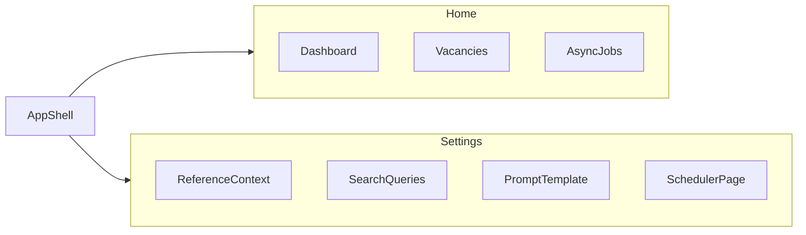

<!-- markdownlint-disable MD013 MD060 -->
# Спецификации UI (web-front)

Декомпозиция постановки на SPA (Vue 3, Vite, TypeScript, Pinia, axios, Material 3 / Vuetify 3) по экранам. Каждый экран — отдельный каталог с `README.md`: макет, алгоритмы элементов, сценарии при открытии и обновлении.

## Оглавление экранов

- [Оболочка приложения](app-shell/README.md) — split меню/контент (ширина и скрытие меню, резиновый контент), тема, базовые URL
- [Дашборд](dashboard/README.md) — релевантные вакансии в рассмотрении, таблица, инлайн-статусы; блок последних корневых async jobs (`GET /async-jobs/last-root-status`)
- [Таблица вакансий и карточка](job-postings-panel/README.md) — общая панель таблицы (дашборд и «Вакансии»), модалка полей, кнопка переоценки `POST /evaluate/sync/{uuid}`
- [Оркестратор](orchestrator-async-jobs/README.md) — таблица асинхронных джобов (`GET /async-jobs/list`), фильтры и модалка деталей; связанные UUID (`GET /async-jobs/{jobUuid}/list/related`); вход по ссылке с query `jobUuid` и `openDetail`
- [Эталонный контекст](reference-context/README.md)
- [Поисковые запросы](search-queries/README.md) — запросы hh.ru, пороги релевантности на строке, флаги активности и «ленивого» сбора
- [Настройка промпта](prompt-template/README.md)
- [Планировщик](scheduler/README.md) — интервал между запусками (ISO-8601 duration), следующий запуск и принудительный запуск в `orchestration-scheduler`

## Маршруты (логическая карта)

| Раздел меню | Подпункт | Документ |
|-------------|----------|----------|
| Главная | Дашборд (по умолчанию) | [dashboard/README.md](dashboard/README.md) |
| Главная | Вакансии | [job-postings-panel/README.md](job-postings-panel/README.md) |
| Главная | Оркестратор | [orchestrator-async-jobs/README.md](orchestrator-async-jobs/README.md) |
| Настройки | Эталонный контекст (по умолчанию) | [reference-context/README.md](reference-context/README.md) |
| Настройки | Поисковые запросы | [search-queries/README.md](search-queries/README.md) |
| Настройки | Настройка промпта | [prompt-template/README.md](prompt-template/README.md) |
| Настройки | Планировщик | [scheduler/README.md](scheduler/README.md) |

## Диаграмма навигации

```mermaid
flowchart LR
  subgraph home [Home]
    dash[Dashboard]
    vac[Vacancies]
    asyncJobs[AsyncJobs]
  end
  subgraph settings [Settings]
    ref[ReferenceContext]
    sq[SearchQueries]
    pt[PromptTemplate]
    sch[SchedulerPage]
  end
  shell[AppShell] --> home
  shell --> settings
```

## Переменные окружения фронта

Задаются в `.env` / сборке Vite (префикс `VITE_`).

| Переменная | Назначение |
|------------|------------|
| `VITE_SETTINGS_MANAGER_BASE_URL` | Базовый URL сервиса настроек |
| `VITE_JOB_POSTINGS_CRUD_BASE_URL` | Базовый URL CRUD вакансий |
| `VITE_JOB_POSTINGS_EVALUATOR_BASE_URL` | Базовый URL сервиса оценивания вакансий (`/evaluate/...`); пусто — same-origin (nginx/Vite proxy) |
| `VITE_ORCHESTRATION_CONDUCTOR_BASE_URL` | Базовый URL `orchestration-conductor` для ручного enqueue (`/enqueue/...`); пусто — same-origin (nginx/Vite proxy) |
| `VITE_ORCHESTRATION_SCHEDULER_BASE_URL` | Базовый URL `orchestration-scheduler` (`/settings/...`, `/execute`); пусто — same-origin (nginx/Vite proxy) |
| `VITE_ORCHESTRATION_ASYNC_JOBS_CRUD_BASE_URL` | Базовый URL `orchestration-async-jobs-crud` (`/async-jobs/...`); пусто — same-origin (префикс `/orchestration-async-jobs-crud/`, nginx/Vite proxy) |

Аутентификация на фронте не предусмотрена. CORS настраивается на каждом Spring-сервисе под origin фронта (dev: origin Vite; prod: URL nginx).

## Бэкенд-контракты

- Вакансии: [services/job-postings-crud/openapi.yaml](../services/job-postings-crud/openapi.yaml)
- Оценивание вакансий: [services/job-postings-evaluator/openapi.yaml](../services/job-postings-evaluator/openapi.yaml)
- Настройки: [services/settings-manager/openapi.yaml](../services/settings-manager/openapi.yaml)
- Ручной запуск сбора (enqueue в Kafka): [services/orchestration-conductor/openapi.yaml](../services/orchestration-conductor/openapi.yaml)
- Планировщик (расписание, список настроек, execute): [services/orchestration-scheduler/openapi.yaml](../services/orchestration-scheduler/openapi.yaml)
- Учёт async jobs: [services/orchestration-async-jobs-crud/openapi.yaml](../services/orchestration-async-jobs-crud/openapi.yaml)

## Визуальный ориентир

Минимализм, много воздуха, нейтральная типографика; референс по ощущению — [Qwen Chat][qwen].

[qwen]: https://chat.qwen.ai/
