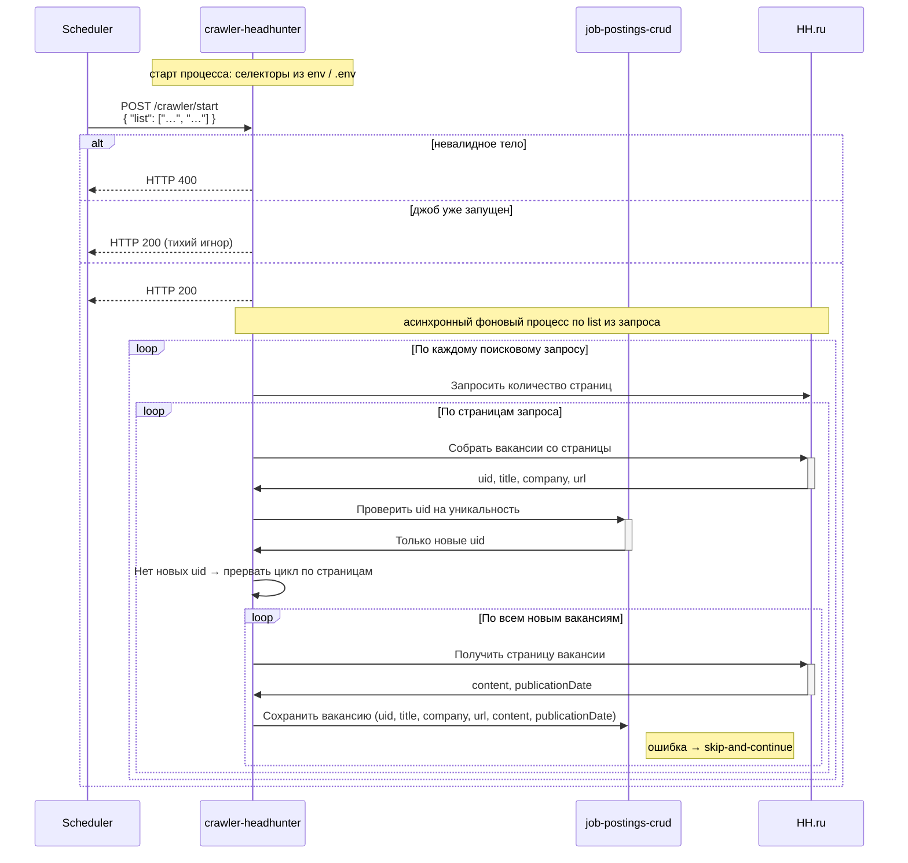

# crawler-headhunter

Сервис сбора новых вакансий с сайта hh.ru.

Сервис представляет из себя backend-приложение на node.js, запускающее playwrite, с его помощью осуществляющее сбор данных с UI сайта hh.ru и запись собранных данных в БД.

crawler-headhunter собирает данные с html-страниц сайта hh.ru и сохраняет данные в БД при помощи сервиса [job-postings-crud].

## Конфигурация CSS-селекторов

Значения CSS-селекторов для разметки hh.ru crawler загружает **при старте процесса** из переменных окружения и/или из `.env`-файла (в порядке, принятом в приложении: обычно `.env` дополняет окружение). К `settings-manager` за селекторами crawler **не** обращается.

В ходе одного задания сбора используются уже загруженные в память значения (например, селекторы для списка страниц, карточек вакансий и т.д., в том числе логически соответствующие прежним именам вроде `JOB_POSTING_LIST_PAGES_LINKS`, `JOB_POSTING_LIST_CARDS`).

## Запуск задания сбора данных

`POST /crawler/start`

| Входной параметр                        | Источник       | Описание                                |
|-----------------------------------------|----------------|-----------------------------------------|
| 📌 `{searchQueries}`                    | тело запроса   | Список поисковых запросов для hh.ru     |
| `correlationId`                         | тело           | UUID корреляции с [celery-orchestrator] |
| 📌 `SELECTOR_VACANCY_LIST_PAGES_LINKS`  | env-переменная | CSS-селектор                            |
| 📌 `BASE_URL`                           | env-переменная | <http://hh.ru>                          |
| 📌 `JOB_POSTING_LIST_CARDS`             | env-переменная | CSS-селектор                            |
| 📌 `SELECTOR_VACANCY_LIST_CARD_TITLE`   | env-переменная | CSS-селектор                            |
| 📌 `SELECTOR_VACANCY_LIST_CARD_COMPANY` | env-переменная | CSS-селектор                            |
| 📌 `SELECTOR_VACANCY_CARD_CONTENT`      | env-переменная | CSS-селектор                            |

Алгоритм работы:

1. Если тело запроса не соответствует контракту — возвращает `HTTP 400`.
2. Если процесс сбора уже запущен — немедленно возвращает `HTTP 200` без запуска нового задания.
3. Запускает процесс сбора в фоновом потоке и немедленно возвращает `HTTP 200`:
   1. При возникновении любого исключения в ходе запуска джоба возвращает `HTTP 500` с текстом исключения в теле ответа.
4. Для каждого поискового запроса из `{searchQueries.list}`:
   1. Запрашивает у HH.ru количество страниц результатов:
      1. Запрашивает первую страницу поискового запроса;
      2. Получает массив ссылок на страницы пагинации селектором `SELECTOR_VACANCY_LIST_PAGES_LINKS`;
         1. Если массив пустой, значит страница только одна
         2. Из найденных элементов берет атрибут `href` и строит ссылки `BASE_URL`+`href`, обозначим массив как `{pages}`
   2. Начинает обход страниц с учетом, что первая уже получена, она в текущем окне и ее заново запрашивать не нужно
   3. Для каждой страницы:
      1. Собирает элементы карточек вакансий селектором `JOB_POSTING_LIST_CARDS`;
      2. Непосредственно из элемента карточки получает атрибут `id`, который является `uid` вакансии;
      3. Из карточки селектором `SELECTOR_VACANCY_LIST_CARD_TITLE` получает название вакансии, это будет `title`;
      4. Строит `url` путем `BASE_URL` + `/vacancy/` + `uid`;
      5. Из карточки селектором `SELECTOR_VACANCY_LIST_CARD_COMPANY` получает название компании, это будет `company`;
      6. Собирает найденные `uid` в массив и через `job-postings-crud` получает только новые `uid`:
         1. `GET http://job-postings-crud:8080/job-postings/search-query/non-existent`.
      7. Если новых `uid` нет — прерывает цикл по страницам;
      8. Для каждой новой вакансии:
         1. Получает текст вакансии в `content`:
            1. Селектором `SELECTOR_VACANCY_CARD_CONTENT` находит элемент;
            2. получает его html-содержимое в виде строки;
            3. очищает от html-тэгов.
         2. Получает дату публикации:
            1. Находит на странице текст `Вакансия опубликована \d+\s\w+\s\d+.*`;
            2. Этот текст использует в качестве `publicationDate`.
         3. Сохраняет вакансию через `job-postings-crud`: `uid`, `title`, `company`, `url`, `content`, `publicationDate`:
            1. `POST http://job-postings-crud:8080/job-postings/{jobPostingUuid}`;
            2. UUID v4 для `{jobPostingUuid}` crawler генерит сам.
5. При возникновении любого исключения — пропускает вакансию и продолжает (skip-and-continue).

### Случай переданного `correlationId` (интеграция с celery-orchestrator)

Базовый URL сервиса оркестратора задаётся конфигурацией (например переменная окружения `CELERY_ORCHESTRATOR_BASE_URL`, по умолчанию `http://celery-orchestrator:8080`). В теле запросов к оркестратору поле `collectionQueryTaskUuid` **равно** переданному в `POST /crawler/start` полю `correlationId`.

События ставятся в брокер Celery через REST-эндпоинты [queue-broker](../celery-orchestrator/openapi.yaml) (`POST …/queue-broker/events/collection-query-progress` и `…/collection-query-complete`). Успешный ответ оркестратора — `HTTP 204`.

1. **Расчёт процента выполнения по страницам.** После определения массива страниц `{pages}` (см. шаг 4.1) crawler вычисляет `totalPages` = длина `{pages}` (если страница одна и массив пагинации пуст — `totalPages` = 1). Для обрабатываемой страницы с **номером** `currentPage` (1…`totalPages`, первая уже открыта в окне и считается страницей 1) процент выполнения обхода выдачи по **текущему** поисковому запросу задаётся как  
   `progressPercent = min(100, round(100 * currentPage / totalPages))`  
   (целое 0…100; при необходимости иная дискретизация допускается, но контракт для UI — монотонный неубывающий процент по мере роста `currentPage`).

2. **После каждой успешно обработанной страницы** (после шага 4.3 для данной страницы, до перехода к следующей странице) crawler отправляет в оркестратор `POST …/queue-broker/events/collection-query-progress` с телом JSON по схеме `CollectionQueryProgressEvent`:
   1. `collectionQueryTaskUuid` = `correlationId`;
   2. `currentPage`, `totalPages` — как выше;
   3. в объекте `detail` передаётся как минимум:
      1. `progressPercent` — рассчитанное значение;
      2. `pageVacancyUids` — массив строк: внешние `uid` вакансий **с этой страницы**, которые в рамках прохода по странице были успешно сохранены в `job-postings-crud` (если новых не было — пустой массив);
   4. при необходимости в `executionLogFragment` — краткая текстовая сводка (например число карточек и сохранённых записей).

3. **После обхода всех страниц** текущего поискового запроса (нормальное завершение цикла по `{pages}`) crawler отправляет `POST …/queue-broker/events/collection-query-complete` с телом `CollectionQueryCompleteEvent`:
   1. `collectionQueryTaskUuid` = `correlationId`;
   2. `executionLog` — сводка по запросу (строка или объект);
   3. `result` — структурированный итог (например итоговые счётчики сохранённых вакансий, признак полного обхода, последний `progressPercent` = 100).

4. **Исключения в ходе обработки страницы.** Если при обработке **текущей страницы** возникает исключение, которое **не** поглощается внутренней политикой skip-and-continue для отдельной вакансии (то есть прерывается штатный поток страницы: ошибка загрузки/парсинга списка, недоступность `job-postings-crud` для шага проверки `non-existent`, иная фатальная ошибка уровня страницы), crawler **до** выхода из цикла по страницам отправляет `POST …/queue-broker/events/collection-query-progress` с теми же обязательными полями идентификации и, по возможности, `currentPage` / `totalPages`, а в `detail` обязательно передаёт диагностику, например:
   1. `error` — логическое `true`;
   2. `errorMessage` — текст сообщения исключения;
   3. `errorType` — имя класса или код ошибки;
   4. при наличии — `stack` или иные поля, согласованные с политикой логирования (без утечки секретов).  
   После отправки события crawler **прекращает** обход страниц для данного поискового запроса из `{searchQueries.list}` и переходит к следующему запросу в списке (или завершает фоновое задание, если запросов больше нет). Отдельный вызов `collection-query-complete` в этом сценарии **не** выполняется (завершение с ошибкой сигнализируется оркестратору событием прогресса с `detail.error`; при необходимости реализация оркестратора может по этому событию перевести задачу в `FAILED`).

**Досрочный выход без ошибки:** если по правилам шага 4.3.7 новых `uid` нет и цикл по страницам прерывается, перед завершением работы по запросу crawler при наличии `correlationId` отправляет `collection-query-complete` с итогом, отражающим досрочную остановку (например в `result` указать причину «нет новых вакансий»), опционально предварительно отправив последний `collection-query-progress` с актуальным `progressPercent` для последней обработанной страницы.

**Ошибка HTTP при вызове оркестратора:** событие логируется; по политике реализации допускаются повторные попытки с backoff; при полном отказе доставки crawler продолжает локальную обработку или прерывает задание — вне детализации данной спецификации.

**Несколько запросов в `list`.** Поле `correlationId` в контракте [openapi.yaml](./openapi.yaml) одно на всё тело `SearchQueriesList`. Описанная выше схема предполагает **одну** оркестрационную задачу `COLLECTION_QUERY` на один запуск обхода; при нескольких строках в `list` вызывающая сторона и реализация crawler должны согласовать, используется ли один вызов `POST /crawler/start` на один поисковый запрос (рекомендуется для UC-02) или иной маппинг `correlationId` на элементы списка.

### Диаграмма последовательности

[job-postings-crud]: ../job-postings-crud/index.md
[celery-orchestrator]: ../celery-orchestrator/openapi.yaml
