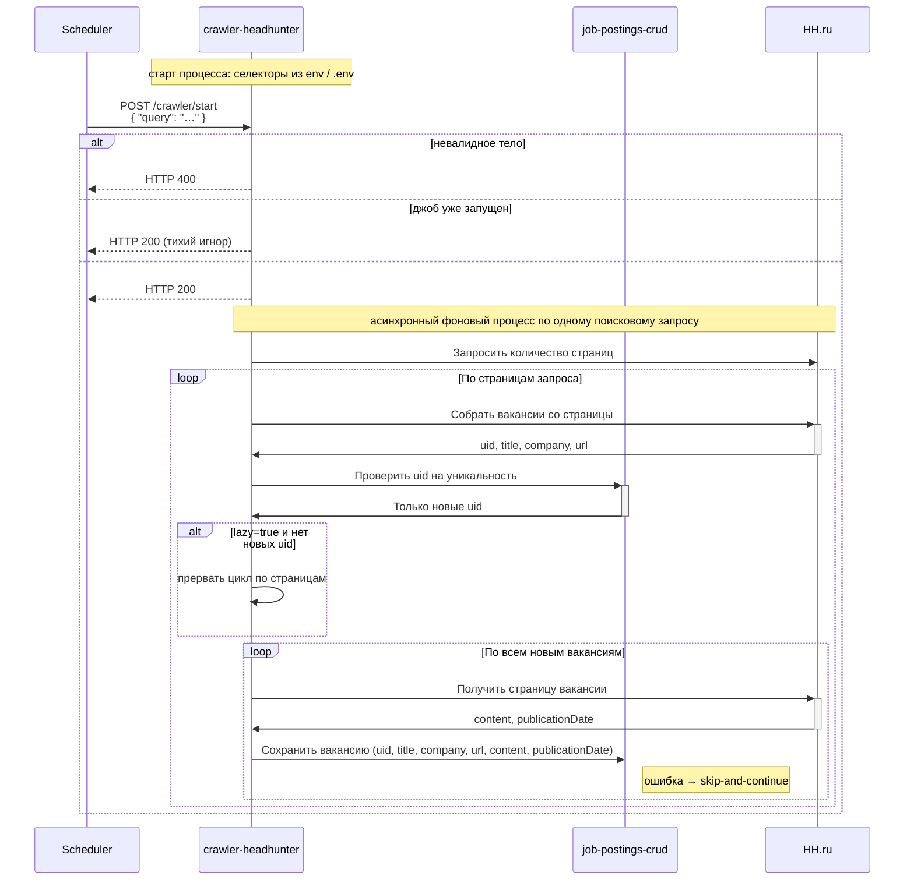

# crawler-headhunter

Сервис сбора новых вакансий с сайта hh.ru.

Представляет из себя backend-приложение на node.js, запускающее playwrite, с его помощью осуществляющее сбор данных с UI сайта hh.ru и запись собранных данных в БД.

crawler-headhunter собирает данные с html-страниц сайта hh.ru и сохраняет данные в БД при помощи сервиса [job-postings-crud].

## Конфигурация CSS-селекторов

Значения CSS-селекторов для разметки hh.ru crawler загружает **при старте процесса** из переменных окружения и/или из `.env`-файла (в порядке, принятом в приложении: обычно `.env` дополняет окружение). К `settings-manager` за селекторами crawler **не** обращается.

В ходе одного задания сбора используются уже загруженные в память значения (например, селекторы для списка страниц, карточек вакансий и т.д., в том числе логически соответствующие прежним именам вроде `JOB_POSTING_LIST_PAGES_LINKS`, `JOB_POSTING_LIST_CARDS`).

## Запуск задания сбора данных

`POST /crawler/start`

| Входной параметр                        | Источник                                         | Описание                                       |
|-----------------------------------------|--------------------------------------------------|------------------------------------------------|
| 📌 `{searchQuery}`                      | поле `query` тела запроса                        | Поисковый запрос для hh.ru                     |
| `{lazy}`                                | поле `lazy` тела запроса                         | `boolean`, по умолчанию `false`; см. п. 5.7    |
| `{correlationId}`                       | заголовок запроса `X-Joposcragent-correlationId` | uuid родительского джоба в celery-orchestrator |
| 📌 `SELECTOR_VACANCY_LIST_PAGES_LINKS`  | env-переменная                                   | CSS-селектор                                   |
| 📌 `BASE_URL`                           | env-переменная                                   | <http://hh.ru>                                 |
| 📌 `JOB_POSTING_LIST_CARDS`             | env-переменная                                   | CSS-селектор                                   |
| 📌 `SELECTOR_VACANCY_LIST_CARD_TITLE`   | env-переменная                                   | CSS-селектор                                   |
| 📌 `SELECTOR_VACANCY_LIST_CARD_COMPANY` | env-переменная                                   | CSS-селектор                                   |
| 📌 `SELECTOR_VACANCY_CARD_CONTENT`      | env-переменная                                   | CSS-селектор                                   |

Алгоритм работы:

1. Если тело запроса не соответствует контракту — возвращает `HTTP 400`.
2. Запускает процесс сбора в фоновом потоке и немедленно возвращает `HTTP 200`:
   1. При возникновении любого исключения в ходе запуска джоба возвращает `HTTP 500` с текстом исключения в теле ответа.
3. Вычисляет количество страниц результатов:
   1. Запрашивает первую страницу поискового запроса `{searchQuery}`;
   2. Получает массив ссылок на страницы пагинации селектором `SELECTOR_VACANCY_LIST_PAGES_LINKS`;
      1. Если массив пустой, значит страница только одна
      2. Из найденных элементов берет атрибут `href` и строит ссылки `BASE_URL`+`href`, обозначим массив как `{pages}`
4. Начинает обход страниц с учетом, что первая уже получена, она в текущем окне и ее заново запрашивать не нужно.
5. Для каждой страницы:
   1. Собирает элементы карточек вакансий селектором `JOB_POSTING_LIST_CARDS`;
   2. Непосредственно из элемента карточки получает атрибут `id`, который является `uid` вакансии;
   3. Из карточки селектором `SELECTOR_VACANCY_LIST_CARD_TITLE` получает название вакансии, это будет `title`;
   4. Строит `url` путем `BASE_URL` + `/vacancy/` + `uid`;
   5. Из карточки селектором `SELECTOR_VACANCY_LIST_CARD_COMPANY` получает название компании, это будет `company`;
   6. Собирает найденные `uid` в массив и через `job-postings-crud` получает только новые `uid`:
      1. `GET http://job-postings-crud:8080/job-postings/search-query/non-existent`.
   7. Если `{lazy}` равен `true` и новых `uid` нет — прерывает цикл по страницам; если `{lazy}` равен `false` (в том числе по умолчанию при отсутствии поля в теле), цикл по страницам из-за отсутствия новых `uid` не прерывается;
   8. Для каждой новой вакансии:
      1. Получает текст вакансии в `content`:
         1. Селектором `SELECTOR_VACANCY_CARD_CONTENT` находит элемент;
         2. получает его html-содержимое в виде строки;
         3. очищает от html-тэгов и заменяет неразрывные пробелы (`&nbsp;`) на обычные.
      2. Получает дату публикации:
         1. Находит на странице текст `Вакансия опубликована \d+\s\w+\s\d+.*`;
         2. Этот текст использует в качестве `publicationDate`.
      3. Сохраняет вакансию через `job-postings-crud`: `uid`, `title`, `company`, `url`, `content`, `publicationDate`:
         1. `POST http://job-postings-crud:8080/job-postings/{jobPostingUuid}`;
         2. UUID v4 для `{jobPostingUuid}` crawler генерит сам;
      4. При возникновении любого исключения, логирует ошибку и продолжает цикл.
6. Отправка событий progress и finish в в `celery-orchestrator`:
   1. События отправляются только и исключительно, если заголовок `{correlationId}` был передан содержит не пустую строку.
   2. После записи каждой вакансии отправляет `POST /events-queue/progress` в `celery-orchestrator`:
      1. `correlationId` = `{correlationId}`;
      2. `createdAt` = текущий момент времени;
      3. `executionLog` = фрагмент лога, сгенерированного во время обработки вакансии (`vacancyLogCapture.takeAndClear()`);
      4. `jobPostingUuid` = `{jobPostingUuid}`
      5. `status` - если не было исключений в ходе обработки вакансии, то `"SUCCEEDED"`, иначе `"FAILED"`
   3. После прохода каждой страницы, если их больше одной, отправляет `POST /events-queue/progress`:
      1. `correlationId` = `{correlationId}`;
      2. `createdAt` = текущий момент времени;
      3. `executionLog` = `"Обработана страница ${текущий номер} из ${всего страниц}"`
   4. После завершения всей обработки отправляет `POST /events-queue/finish`:
      1. `correlationId` = `{correlationId}`;
      2. `createdAt` = текущий момент времени;
      3. `status` - если не было исключений в ходе обработки, то `"SUCCEEDED"`, иначе `"FAILED"`;
      4. Если обработано успешно, то `result` = `"Обработано страниц ${сколько обработано}, загружено ${количество} новых вакансий"`;
      5. Если обработка прервана по исключению:
         1. `result` = message или любой краткий текст ошибки
         2. `executionLog` = полный текст исключения

### Диаграмма последовательности

[job-postings-crud]: ../job-postings-crud/index.md
