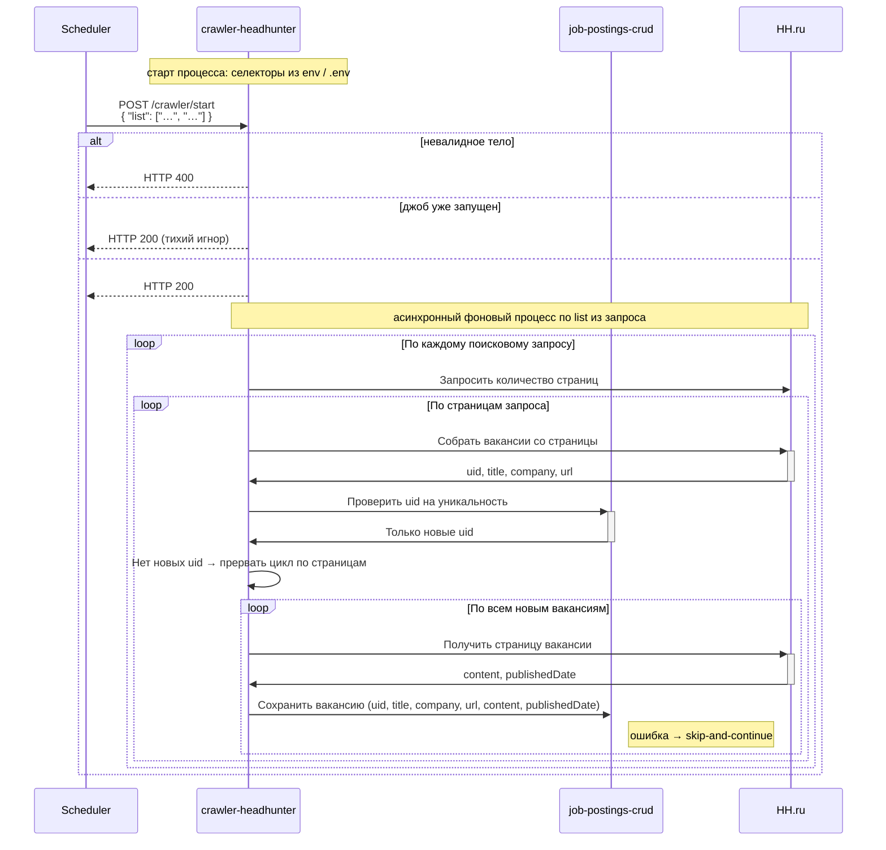

# crawler-headhunter

Сервис сбора новых вакансий с сайта hh.ru.

Сервис представляет из себя backend-приложение на node.js, запускающее playwrite, с его помощью осуществляющее сбор данных с UI сайта hh.ru и запись собранных данных в БД.

crawler-headhunter собирает данные с html-страниц сайта hh.ru и сохраняет данные в БД при помощи сервиса [job-postings-crud].

## Конфигурация CSS-селекторов

Значения CSS-селекторов для разметки hh.ru crawler загружает **при старте процесса** из переменных окружения и/или из `.env`-файла (в порядке, принятом в приложении: обычно `.env` дополняет окружение). К `settings-manager` за селекторами crawler **не** обращается.

В ходе одного задания сбора используются уже загруженные в память значения (например, селекторы для списка страниц, карточек вакансий и т.д., в том числе логически соответствующие прежним именам вроде `JOB_POSTING_LIST_PAGES_LINKS`, `JOB_POSTING_LIST_CARDS`).

## Запуск задания сбора данных

`POST /crawler/start`

| Входной параметр      | Источник     | Описание                             |
|-----------------------|--------------|--------------------------------------|
| 📌 `{searchQueries}`  | тело запроса | Список поисковых запросов для hh.ru  |

Алгоритм работы:

1. Если тело запроса не соответствует контракту — возвращает `HTTP 400`.
2. Если процесс сбора уже запущен — немедленно возвращает `HTTP 200` без запуска нового задания.
3. Запускает процесс сбора в фоновом потоке и немедленно возвращает `HTTP 200`:
   1. При возникновении любого исключения в ходе запуска джоба возвращает `HTTP 500` с текстом исключения в теле ответа.
4. Для каждого поискового запроса из `{searchQueries.list}`:
   1. Запрашивает у HH.ru количество страниц результатов:
      1. Запрашивает первую страницу поискового запроса;
      2. Ищет элемент селектором `JOB_POSTING_LIST_PAGES_LINKS` и пересчитывает количество элементов `<li>`;
      3. Если селектором ничего не нашлось, значит страница только одна.
   2. Для каждой страницы:
      1. Собирает карточки вакансий селектором `JOB_POSTING_LIST_CARDS`;
      2. Из карточек собирает метаданные: `uid`, `title`, `company`, `url`;
      3. Собирает найденные `uid` в массив и через `job-postings-crud` получает только новые `uid`:
         1. `GET http://job-postings-crud:8080/job-postings/search-query/non-existent`.
      4. Если новых `uid` нет — прерывает цикл по страницам;
      5. Для каждой новой вакансии:
         1. Получает страницу вакансии путем открытия страницы вакансии по `url` в новой вкладке;
         2. Собирает со страницы вакансии данные: `content`, `publishedDate`;
         3. Очищает `content` от html-тэгов и разметки;
         4. Сохраняет вакансию через `job-postings-crud`: `uid`, `title`, `company`, `url`, `content`, `publishedDate`:
            1. `POST http://job-postings-crud:8080/job-postings/{jobPostingUuid}`;
            2. UUID v4 для `{jobPostingUuid}` crawler генерит сам.
         5. При возникновении любого исключения — пропускает вакансию и продолжает (skip-and-continue).

### Диаграмма последовательности

[job-postings-crud]: ../job-postings-crud/index.md
