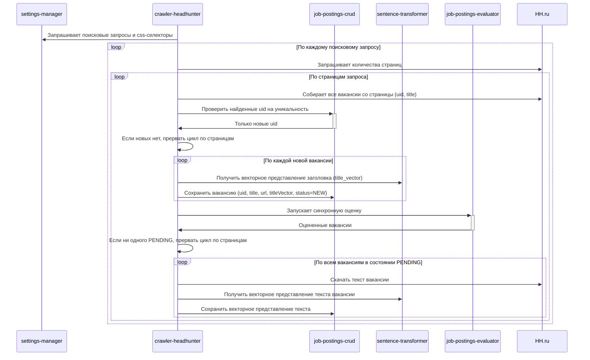

# crawler-headhunter

Сервис сбора новых вакансий с сайта hh.ru.

Сервис представляет из себя backend-приложение на node.js, запускающее playwrite, с его помощью осуществляющее сбор данных с UI сайта hh.ru и запись собранных данных в БД.

crawler-headhunter для выполнения своих функций активно взаимодействует по REST с сервисами:

- settings-manager
- crawler-headhunter
- job-postings-crud
- sentence-transformer
- job-postings-evaluator

## Запуск задания сбора данных

`POST /crawler/start`

Входных параметров нет.

Алгоритм работы:

1. Немедленно возвращает `HTTP 200` и запускает процесс сбора в фоновом потоке
   1. При возникновении любого исключения в ходе запуска джоба возвращает `HTTP 500` с текстом исключения в теле ответа
2. Все нижеперечисленное выполняет в фоне уже после того, как вернул `HTTP 200`
3. Запрашивает у `settings-manager` список поисковых запросов: `GET http://settings-manager:8080/search-query/list`
4. Запрашивает у `settings-manager` список CSS-селекторов: `GET http://settings-manager:8080/query-selector/list`
5. Для каждого поискового запроса из списка:
   1. Через Playwright открывает страницу поиска и определяет количество страниц результатов (по селектору `JOB_POSTING_LIST_PAGES_LINKS`)
   2. Для каждой страницы результатов:
      1. Через Playwright собирает все карточки вакансий со страницы (uid, title, url) по селекторам `JOB_POSTING_LIST_CARDS`, `JOB_POSTING_LIST_CARD_TITLE`, `JOB_POSTING_LIST_CARD_CONTENT_LINK`
      2. Проверяет uid на уникальность: `POST http://job-postings-crud:8080/job-postings/search-query/non-existent`
         1. Если новых uid нет (ответ `HTTP 404`), прерывает цикл по страницам
      3. Для каждой новой вакансии:
         1. Получает векторное представление заголовка: `POST http://sentence-transformer:8000/text/vectorize` с текстом заголовка; обозначим результат `{titleVector}`
         2. Сохраняет вакансию: `POST http://job-postings-crud:8080/job-postings/{uuid}` с полями uid, title, url, publicationDate, titleVector = `{titleVector}`, evaluationStatus = `NEW`
      4. Запускает синхронную оценку сохранённых вакансий: `POST http://job-postings-evaluator:8080/evaluate/sync` со списком uuid
      5. Если среди оцененных нет ни одной вакансии в статусе `PENDING`, прерывает цикл по страницам
      6. Для каждой вакансии в статусе `PENDING`:
         1. Через Playwright открывает страницу вакансии и извлекает полный текст по селектору `JOB_POSTING_CARD_CONTENT`
         2. Получает векторное представление текста: `POST http://sentence-transformer:8000/text/vectorize` с полным текстом вакансии; обозначим результат `{contentVector}`
         3. Обновляет вакансию: `PUT http://job-postings-crud:8080/job-postings/{uuid}` с полем contentVector = `{contentVector}`

### Диаграмма последовательности

