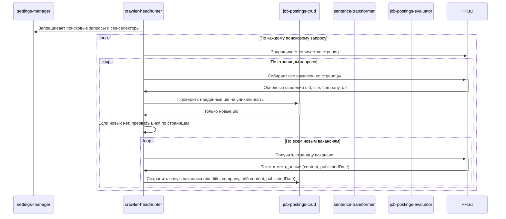

# crawler-headhunter

Сервис сбора новых вакансий с сайта hh.ru.

Сервис представляет из себя backend-приложение на node.js, запускающее playwrite, с его помощью осуществляющее сбор данных с UI сайта hh.ru и запись собранных данных в БД.

crawler-headhunter собирает данные с html-страниц сайта hh.ru и сохраняет данные в БД при помощи сервиса [job-postings-crud].

## Запуск задания сбора данных

`POST /crawler/start`

Входных параметров нет.

Алгоритм работы:

1. Немедленно возвращает `HTTP 200` и запускает процесс сбора в фоновом потоке
   1. При возникновении любого исключения в ходе запуска джоба возвращает `HTTP 500` с текстом исключения в теле ответа

### Диаграмма последовательности

[job-postings-crud]: ../job-postings-crud/index.md
