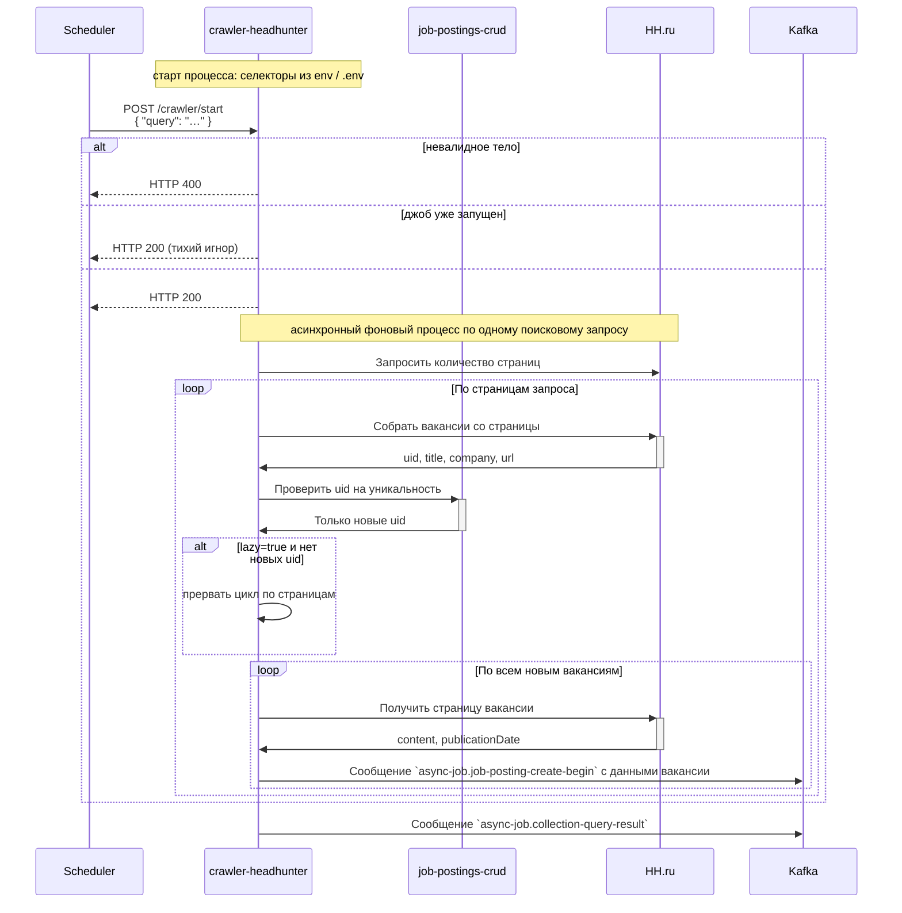

# crawler-headhunter

Сервис сбора новых вакансий с сайта hh.ru.

Представляет из себя backend-приложение на node.js, запускающее playwrite, с его помощью осуществляющее сбор данных с UI сайта hh.ru и запись собранных данных в БД.

crawler-headhunter собирает данные с html-страниц сайта hh.ru и сохраняет данные в БД при помощи сервиса [job-postings-crud].

## Конфигурация CSS-селекторов

Значения CSS-селекторов для разметки hh.ru crawler загружает **при старте процесса** из переменных окружения и/или из `.env`-файла (в порядке, принятом в приложении: обычно `.env` дополняет окружение). К `settings-manager` за селекторами crawler **не** обращается.

В ходе одного задания сбора используются уже загруженные в память значения (например, селекторы для списка страниц, карточек вакансий и т.д., в том числе логически соответствующие прежним именам вроде `JOB_POSTING_LIST_PAGES_LINKS`, `JOB_POSTING_LIST_CARDS`).

## Запуск задания сбора данных

`POST /crawler/start`

| Входной параметр                        | Источник                                         | Описание                                       |
|-----------------------------------------|--------------------------------------------------|------------------------------------------------|
| 📌 `{searchQuery}`                      | Тело запроса                                     | Настройки поиска и сбора данных с hh.ru        |
| `{correlationId}`                       | заголовок запроса `X-Joposcragent-correlationId` | uuid родительского джоба в celery-orchestrator |
| 📌 `SELECTOR_VACANCY_LIST_PAGES_LINKS`  | env-переменная                                   | CSS-селектор                                   |
| 📌 `BASE_URL`                           | env-переменная                                   | <http://hh.ru>                                 |
| 📌 `JOB_POSTING_LIST_CARDS`             | env-переменная                                   | CSS-селектор                                   |
| 📌 `SELECTOR_VACANCY_LIST_CARD_TITLE`   | env-переменная                                   | CSS-селектор                                   |
| 📌 `SELECTOR_VACANCY_LIST_CARD_COMPANY` | env-переменная                                   | CSS-селектор                                   |
| 📌 `SELECTOR_VACANCY_CARD_CONTENT`      | env-переменная                                   | CSS-селектор                                   |

Алгоритм работы:

1. Если тело запроса не соответствует контракту — возвращает `HTTP 400`.
2. Запускает процесс сбора в фоновом потоке и немедленно возвращает `HTTP 200`:
   1. При возникновении любого исключения в ходе запуска джоба возвращает `HTTP 500` с текстом исключения в теле ответа.
3. Вычисляет количество страниц результатов:
   1. Запрашивает первую страницу поискового запроса `{searchQuery}.query`;
   2. Получает массив ссылок на страницы пагинации селектором `SELECTOR_VACANCY_LIST_PAGES_LINKS`;
      1. Если массив пустой, значит страница только одна
      2. Из найденных элементов берет атрибут `href` и строит ссылки `BASE_URL`+`href`, обозначим массив как `{pages}`
4. Начинает обход страниц с учетом, что первая уже получена, она в текущем окне и ее заново запрашивать не нужно.
5. Для каждой страницы:
   1. Собирает элементы карточек вакансий селектором `JOB_POSTING_LIST_CARDS`;
   2. Непосредственно из элемента карточки получает атрибут `id`, который является `uid` вакансии;
   3. Из карточки селектором `SELECTOR_VACANCY_LIST_CARD_TITLE` получает название вакансии, это будет `title`;
   4. Строит `url` путем `BASE_URL` + `/vacancy/` + `uid`;
   5. Из карточки селектором `SELECTOR_VACANCY_LIST_CARD_COMPANY` получает название компании, это будет `company`;
   6. Собирает найденные `uid` в массив и через `job-postings-crud` получает только новые `uid`:
      1. `POST http://job-postings-crud:8080/job-postings/search-query/non-existent` (тело — список `uid`, как в контракте [job-postings-crud]).
   7. Если `{searchQuery}.lazy` равен `true` и новых `uid` нет — прерывает цикл по страницам;
   8. Для каждой новой вакансии:
      1. Получает текст вакансии в `content`:
         1. Селектором `SELECTOR_VACANCY_CARD_CONTENT` находит элемент;
         2. получает его html-содержимое в виде строки;
         3. очищает от html-тэгов и заменяет неразрывные пробелы (`&nbsp;`) на обычные.
      2. Получает дату публикации:
         1. Находит на странице текст `Вакансия опубликована \d+\s\w+\s\d+.*`;
         2. Этот текст использует в качестве `publicationDate`.
      3. Генерирует `{jobPostingUuid}` - новый UUID v4
      4. Отправляет сообщение [`async-job.job-posting-create-begin`]:
         1. Топик: `async-job.job-posting-create`
         2. `headers`:
            1. `key` = `{correlationId}`;
            2. `createdAt` = текущий момент времени
            3. `type` = `async-job.job-posting-create-begin`
            4. `schemaVersion` = `1.0`
         3. `payload`:
            1. `jobUuid` = `{correlationId}`
            2. `entityUuid` = `{jobPostingUuid}`
            3. `searchQueryUuid` = `{searchQuery}.searchQueryUuid`
            4. `uid`, `title`, `url`, `company`, `content`, `publicationDate` - значения, собранные в шагах 5.1 ... 5.8.3
      5. При возникновении любого иного исключения в ходе обработки карточки, логирует ошибку и продолжает цикл.
6. После завершения всей обработки, если заполнен `{correlationId}`, отправляет success-сообщение [`async-job.collection-query-result`]:
   1. Топик: `async-job.collection-query`
   2. `headers`:
      1. `key` = `{correlationId}`;
      2. `createdAt` = текущий момент времени.
      3. `type` = `async-job.collection-query-result`
      4. `schemaVersion` = `1.0`
   3. `payload`:
      1. `jobUuid` = `{correlationId}`;
      2. `pagesProcessed` = `${сколько обработано}`
      3. `newVacanciesSaved` = `${количество}`
      4. `status` = `'SUCCEEDED'`;
      5. `result` = `"Обработано страниц ${сколько обработано}, загружено ${количество} новых вакансий"`.

### Диаграмма последовательности

```mermaid
sequenceDiagram
    participant Scheduler
    participant Crawler as crawler-headhunter
    participant Postings as job-postings-crud
    participant HH as HH.ru

    Note over Crawler: старт процесса: селекторы из env / .env

    Scheduler->>Crawler: POST /crawler/start<br/>{ "query": "…" }

    alt невалидное тело
        Crawler-->>Scheduler: HTTP 400
    else джоб уже запущен
        Crawler-->>Scheduler: HTTP 200 (тихий игнор)
    else
        Crawler-->>Scheduler: HTTP 200
        Note over Crawler,HH: асинхронный фоновый процесс по одному поисковому запросу

        Crawler->>HH: Запросить количество страниц

        loop По страницам запроса
            Crawler->>+HH: Собрать вакансии со страницы
            HH->>-Crawler: uid, title, company, url
            Crawler->>+Postings: Проверить uid на уникальность
            Postings->>-Crawler: Только новые uid
            alt lazy=true и нет новых uid
                Crawler->>Crawler: прервать цикл по страницам
            end

            loop По всем новым вакансиям
                Crawler->>+HH: Получить страницу вакансии
                HH->>-Crawler: content, publicationDate
                Crawler->>Kafka: Сообщение `async-job.job-posting-create-begin` с данными вакансии
            end
        end
    end
    Crawler->>Kafka: Сообщение `async-job.collection-query-result`
```

<!-- LINKS -->
[job-postings-crud]: ../job-postings-crud/index.md
[`async-job.collection-query-result`]: ../../messaging/async-job.collection-query/async-job.collection-query-result.yaml
[`async-job.job-posting-create-begin`]: ../../messaging/async-job.job-posting-create/async-job.job-posting-create-begin.yaml
