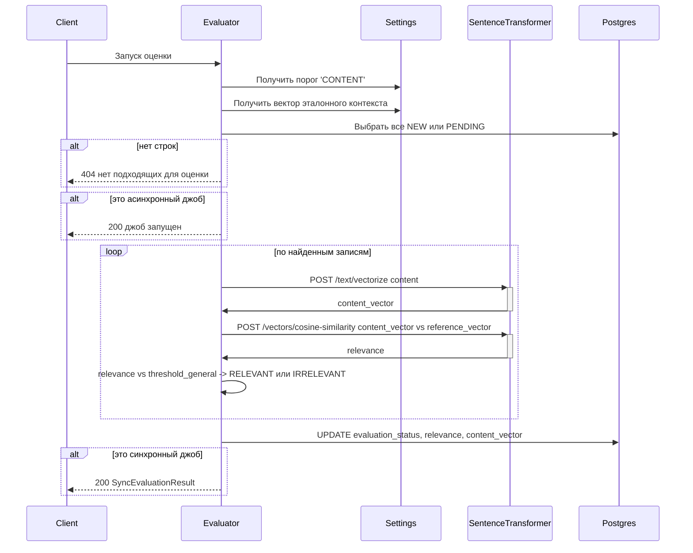

# job-postings-evaluator

Сервис автоматического оценивания вакансий.

Работает с PostgresSQL:

- База данных `joposcragent`
- Схема `job_postings`
- Таблица `postings`

Дополнительно обращается по HTTP к сервисам `settings-manager` и `sentence-transformer` (см. алгоритм синхронной оценки).

## Синхронный запуск оценки

`POST /evaluate/sync/list`

| Входной параметр | Источник     | Описание                        |
|------------------|--------------|---------------------------------|
| 📌 `{uuids}`     | тело запроса | Список внутренних UUID вакансий |

Алгоритм работы:

1. Запрашивает у `settings-manager` пороги релевантности и вектор эталонного контекста:
   1. `GET http://settings-manager:8080/relevance-thresholds/CONTENT` — порог релевантности текста вакансии; обозначим `{threshold_general}`
   2. `GET http://settings-manager:8080/reference-context` — объект с полем `vector`; обозначим `{reference_vector}`
   3. Если порог отсутствует или вектор не задан, записывает в лог соответствующий `WARN`, возвращает HTTP 500 с соответствующим текстом в теле ответа
2. Выбирает из таблицы `postings` все строки, для которых одновременно выполняется:
   1. `uuid` входит во множество UUID из `{uuids.list}`
   2. `evaluation_status` принимает одно из значений `NEW` или `PENDING`
3. Если после отбора не осталось ни одной строки, возвращает `HTTP 404`
4. По всем найденным вакансиям:
   1. Если поле `content_vector` пустое:
      1. Получает вектор запросом `POST http://sentence-transformer:8000/sentence-transformer/text/vectorize`
      2. В тело запроса передает поле `content`
      3. Полученный вектор сохраняет в `content_vector`
   2. Вычисляет сходство `content_vector` и `{reference_vector}` запросом `POST http://sentence-transformer:8000/sentence-transformer/vectors/cosine-similarity`:
      1. Где `VectorsPair`: `left` = `content_vector` строки вакансии, `right` = `{reference_vector}`;
      2. Из ответа берётся поле `{similarity}` и сохраняется в поле `relevance`
   3. Сравнивает `relevance` с `{threshold_general}`:
      1. если `relevance` больше или равно порога — устанавливает для этой вакансии `evaluation_status` = `RELEVANT`;
      2. иначе — `IRRELEVANT`
5. Возвращает `HTTP 200` с массивом uuid и текущих статусов оцененных вакансий
6. При возникновении любого не перехваченного исключения возвращает `HTTP 500` с текстом исключения в теле ответа

## Синхронный запуск оценки одной вакансии

`POST /evaluate/sync/{jobPostingUuid}`

| Входной параметр      | Источник      | Описание                 |
|-----------------------|---------------|--------------------------|
| 📌 `{jobPostingUuid}` | path-параметр | Внутренний UUID вакансии |

Алгоритм работы:

1. Запрашивает у `settings-manager` пороги релевантности и вектор эталонного контекста:
   1. `GET http://settings-manager:8080/relevance-thresholds/CONTENT` — порог релевантности текста вакансии; обозначим `{threshold_general}`
   2. `GET http://settings-manager:8080/reference-context` — объект с полем `vector`; обозначим `{reference_vector}`
   3. Если порог отсутствует или вектор не задан, записывает в лог соответствующий `WARN`, возвращает HTTP 500 с соответствующим текстом в теле ответа
2. Выбирает из таблицы `postings` все строки, для которых одновременно выполняется:
   1. `uuid` входит во множество UUID из `{uuids.list}`
   2. `evaluation_status` принимает одно из значений `NEW` или `PENDING`
3. Если после отбора не осталось ни одной строки, возвращает `HTTP 404`
4. Непосредственно оценка вакансии:
   1. Если поле `content_vector` пустое:
      1. Получает вектор запросом `POST http://sentence-transformer:8000/sentence-transformer/text/vectorize`
      2. В тело запроса передает поле `content`
      3. Полученный вектор сохраняет в `content_vector`
   2. Вычисляет сходство `content_vector` и `{reference_vector}` запросом `POST http://sentence-transformer:8000/sentence-transformer/vectors/cosine-similarity`:
      1. Где `VectorsPair`: `left` = `content_vector` строки вакансии, `right` = `{reference_vector}`;
      2. Из ответа берётся поле `{similarity}` и сохраняется в поле `relevance`
   3. Сравнивает `relevance` с `{threshold_general}`:
      1. если `relevance` больше или равно порога — устанавливает для этой вакансии `evaluation_status` = `RELEVANT`;
      2. иначе — `IRRELEVANT`
5. Записывает обновлённые значения в БД для всех обработанных строк
6. Возвращает `HTTP 200` с uuid и текущим статусом вакансии
7. При возникновении любого не перехваченного исключения возвращает `HTTP 500` с текстом исключения в теле ответа

## Асинхронный запуск оценки

`POST /evaluate/async/list`

| Входной параметр | Источник     | Описание                        |
|------------------|--------------|---------------------------------|
| 📌 `{uuids}`     | тело запроса | Список внутренних UUID вакансий |

Алгоритм работы:

1. Запрашивает у `settings-manager` пороги релевантности и вектор эталонного контекста:
   1. `GET http://settings-manager:8080/relevance-thresholds/CONTENT` — порог релевантности текста вакансии; обозначим `{threshold_general}`
   2. `GET http://settings-manager:8080/reference-context` — объект с полем `vector`; обозначим `{reference_vector}`
   3. Если порог отсутствует или вектор не задан, записывает в лог соответствующий `WARN`, завершает работу
2. Выбирает из таблицы `postings` все строки, для которых одновременно выполняется:
   1. `uuid` входит во множество UUID из `{uuids.list}`
   2. `evaluation_status` принимает одно из значений `NEW` или `PENDING`
3. Если ни одного не найдено, записывает в лог соответствующий `WARN` и завершает работу штатно
4. По всем найденным вакансиям:
   1. Если поле `content_vector` пустое:
      1. Получает вектор запросом `POST http://sentence-transformer:8000/sentence-transformer/text/vectorize`
      2. В тело запроса передает поле `content`
      3. Полученный вектор сохраняет в `content_vector`
   2. Вычисляет сходство `content_vector` и `{reference_vector}` запросом `POST http://sentence-transformer:8000/sentence-transformer/vectors/cosine-similarity`:
      1. Где `VectorsPair`: `left` = `content_vector` строки вакансии, `right` = `{reference_vector}`;
      2. Из ответа берётся поле `{similarity}` и сохраняется в поле `relevance`
   3. Сравнивает `relevance` с `{threshold_general}`:
      1. если `relevance` больше или равно порога — устанавливает для этой вакансии `evaluation_status` = `RELEVANT`;
      2. иначе — `IRRELEVANT`
5. При возникновении любого не перехваченного исключения возвращает `HTTP 500` с текстом исключения в теле ответа

## Асинхронный запуск оценки одной вакансии

`POST /evaluate/async/{jobPostingUuid}`

| Входной параметр      | Источник      | Описание                 |
|-----------------------|---------------|--------------------------|
| 📌 `{jobPostingUuid}` | path-параметр | Внутренний UUID вакансии |

Алгоритм работы:

1. Запрашивает у `settings-manager` пороги релевантности и вектор эталонного контекста:
   1. `GET http://settings-manager:8080/relevance-thresholds/CONTENT` — порог релевантности текста вакансии; обозначим `{threshold_general}`
   2. `GET http://settings-manager:8080/reference-context` — объект с полем `vector`; обозначим `{reference_vector}`
   3. Если порог отсутствует или вектор не задан, записывает в лог соответствующий `WARN`, завершает работу
2. Выбирает из таблицы `postings` все строки, для которых одновременно выполняется:
   1. `uuid` входит во множество UUID из `{uuids.list}`
   2. `evaluation_status` принимает одно из значений `NEW` или `PENDING`
3. Если ни одного не найдено, записывает в лог соответствующий `WARN` и завершает работу штатно
4. Непосредственно оценка вакансии:
   1. Если поле `content_vector` пустое:
      1. Получает вектор запросом `POST http://sentence-transformer:8000/sentence-transformer/text/vectorize`
      2. В тело запроса передает поле `content`
      3. Полученный вектор сохраняет в `content_vector`
   2. Вычисляет сходство `content_vector` и `{reference_vector}` запросом `POST http://sentence-transformer:8000/sentence-transformer/vectors/cosine-similarity`:
      1. Где `VectorsPair`: `left` = `content_vector` строки вакансии, `right` = `{reference_vector}`;
      2. Из ответа берётся поле `{similarity}` и сохраняется в поле `relevance`
   3. Сравнивает `relevance` с `{threshold_general}`:
      1. если `relevance` больше или равно порога — устанавливает для этой вакансии `evaluation_status` = `RELEVANT`;
      2. иначе — `IRRELEVANT`
5. Записывает обновлённые значения в БД для всех обработанных строк
6. При возникновении любого не перехваченного исключения возвращает `HTTP 500` с текстом исключения в теле ответа

## Выполнение оценки переданного набора вакансий (синхронно)

`POST /evaluate/sync`

| Входной параметр | Источник     | Описание                        |
|------------------|--------------|---------------------------------|
| 📌 `{uuids}`     | тело запроса | Список внутренних UUID вакансий |

Алгоритм работы:

6. Возвращает `HTTP 200` и тело `JobPostingsUidsEvaluatedList`: для вакансий, полученных на вход (отобранных на шаге 2), их `uuid` и новые значения `evaluationStatus` после выполнения шагов 4–5
7. При возникновении любого не перехваченного исключения возвращает `HTTP 500` с текстом исключения в теле ответа
