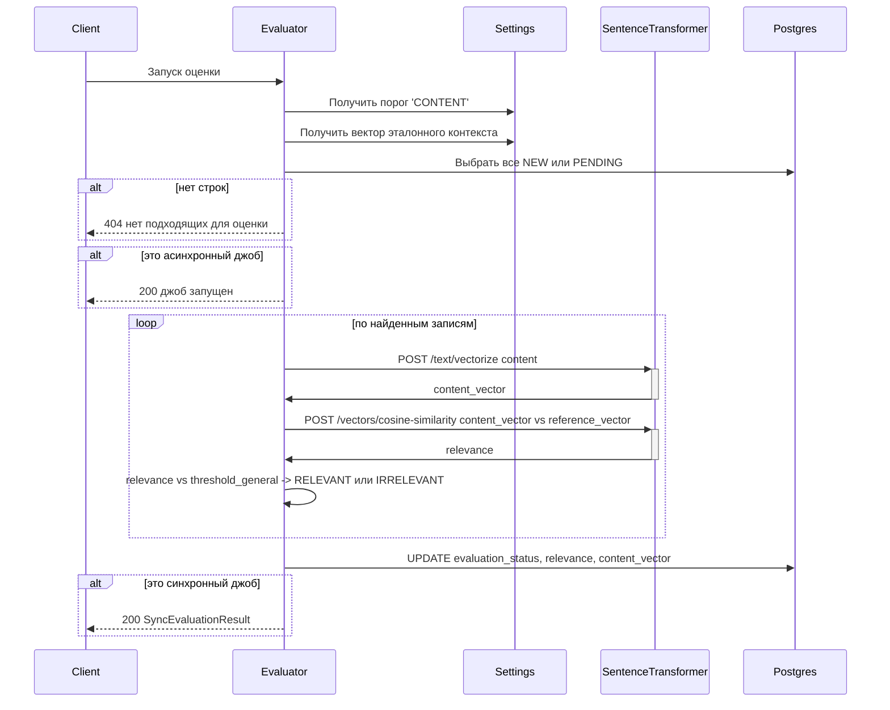

# job-postings-evaluator

Сервис автоматического оценивания вакансий.

Работает с PostgresSQL:

- База данных `joposcragent`
- Схема `job_postings`
- Таблица `postings`

Дополнительно обращается по HTTP к сервисам `settings-manager` и `sentence-transformer` (см. ниже [общий алгоритм оценки](#общий-алгоритм-оценки)).

## Общий алгоритм оценки

Ниже — шаги, общие для всех эндпоинтов оценки. Различия (как задаётся набор вакансий, ответы HTTP, поведение при пустом отборе и при ошибках настроек) задаются в разделах конкретных операций.

### 1. Загрузка порога и эталонного вектора

1. `GET http://settings-manager:8080/relevance-thresholds/CONTENT` — порог релевантности текста вакансии; обозначим `{threshold_general}`.
2. `GET http://settings-manager:8080/reference-context` — объект с полем `vector`; обозначим `{reference_vector}`.

### 2. Отбор строк в `postings`

Выбираются все строки, для которых одновременно:

1. `uuid` входит в **целевой набор UUID** (в операциях со списком — элементы `{uuids.list}` из тела запроса; в операциях по одной вакансии — единственный `{jobPostingUuid}` из path).
2. `evaluation_status` принимает одно из значений `NEW` или `PENDING`.

### 3. Оценка каждой отобранной строки

Для каждой строки из результата п.2:

1. Если поле `content_vector` пустое:
   1. Получает вектор запросом `POST http://sentence-transformer:8000/sentence-transformer/text/vectorize`.
   2. В тело запроса передаёт поле `content`.
   3. Полученный вектор сохраняет в `content_vector`.
2. Вычисляет сходство `content_vector` и `{reference_vector}` запросом `POST http://sentence-transformer:8000/sentence-transformer/vectors/cosine-similarity`:
   1. Где `VectorsPair`: `left` = `content_vector` строки вакансии, `right` = `{reference_vector}`;
   2. Из ответа берётся поле `{similarity}` и сохраняется в поле `relevance`.
3. Сравнивает `relevance` с `{threshold_general}`:
   1. если `relevance` больше или равно порога — устанавливает для этой вакансии `evaluation_status` = `RELEVANT`;
   2. иначе — `IRRELEVANT`.

### 4. Запись в БД

Обновляет в таблице `postings` у обработанных строк поля `evaluation_status`, `relevance`, `content_vector` (в соответствии с результатами п.3).

### Поведение при ошибках и пустом отборе

| Ситуация                                        | Синхронные эндпоинты                               | Асинхронные эндпоинты                    |
|-------------------------------------------------|----------------------------------------------------|------------------------------------------|
| После п.1 порог отсутствует или вектор не задан | `WARN` в лог, **HTTP 500** с текстом в теле ответа | `WARN` в лог, джоб завершается           |
| После п.2 не осталось ни одной строки           | **HTTP 404**                                       | `WARN` в лог, джоб завершается штатно    |
| Необработанное исключение                       | **HTTP 500** с текстом исключения в теле           | **HTTP 500** с текстом исключения в теле |

---

## Синхронный запуск оценки

`POST /evaluate/sync/list`

| Входной параметр | Источник     | Описание                        |
|------------------|--------------|---------------------------------|
| 📌 `{uuids}`     | тело запроса | Список внутренних UUID вакансий |

**Алгоритм:** [п.1](#1-загрузка-порога-и-эталонного-вектора) и [п.2](#2-отбор-строк-в-postings) с целевым набором из `{uuids.list}`; при ошибках и пустом отборе — [таблица](#поведение-при-ошибках-и-пустом-отборе) (колонка «Синхронные»). Затем [п.3](#3-оценка-каждой-отобранной-строки) по всем найденным строкам, [п.4](#4-запись-в-бд). Возвращает **HTTP 200** с массивом uuid и текущих статусов оценённых вакансий.

## Синхронный запуск оценки одной вакансии

`POST /evaluate/sync/{jobPostingUuid}`

| Входной параметр      | Источник      | Описание                 |
|-----------------------|---------------|--------------------------|
| 📌 `{jobPostingUuid}` | path-параметр | Внутренний UUID вакансии |

**Алгоритм:** [п.1](#1-загрузка-порога-и-эталонного-вектора), [п.2](#2-отбор-строк-в-postings) с целевым набором `{jobPostingUuid}`; при ошибках и пустом отборе — [таблица](#поведение-при-ошибках-и-пустом-отборе) (синхронно). Затем [п.3](#3-оценка-каждой-отобранной-строки) (фактически одна вакансия), [п.4](#4-запись-в-бд). Возвращает **HTTP 200** с uuid и текущим статусом вакансии.

## Асинхронный запуск оценки

`POST /evaluate/async/list`

| Входной параметр | Источник     | Описание                        |
|------------------|--------------|---------------------------------|
| 📌 `{uuids}`     | тело запроса | Список внутренних UUID вакансий |

**Алгоритм:** [п.1](#1-загрузка-порога-и-эталонного-вектора) и [п.2](#2-отбор-строк-в-postings) с целевым набором из `{uuids.list}`; при ошибках настройки и пустом отборе — [таблица](#поведение-при-ошибках-и-пустом-отборе) (колонка «Асинхронные»). Затем [п.3](#3-оценка-каждой-отобранной-строки) по всем найденным строкам, [п.4](#4-запись-в-бд). Исключения — по [таблице](#поведение-при-ошибках-и-пустом-отборе).

## Асинхронный запуск оценки одной вакансии

`POST /evaluate/async/{jobPostingUuid}`

| Входной параметр      | Источник      | Описание                            |
|-----------------------|---------------|-------------------------------------|
| 📌 `{jobPostingUuid}` | path-параметр | Внутренний UUID вакансии            |
| `evaluationTaskUuid`  | тело          | UUID оркестрационной задачи         |
| `parentTaskUuid`      | тело          | родительская оркестрационная задача |

Базовый URL **celery-orchestrator** задаётся конфигурацией (например `CELERY_ORCHESTRATOR_BASE_URL`, по умолчанию `http://celery-orchestrator:8080`). Успешный ответ оркестратора на `POST …/queue-broker/events/evaluation-complete` — `HTTP 204`.

**Алгоритм (базовый):** [п.1](#1-загрузка-порога-и-эталонного-вектора), [п.2](#2-отбор-строк-в-postings) с целевым набором `{jobPostingUuid}`; при ошибках настройки и пустом отборе — [таблица](#поведение-при-ошибках-и-пустом-отборе) (асинхронно). Затем [п.3](#3-оценка-каждой-отобранной-строки), [п.4](#4-запись-в-бд).

**Дополнение, если в запросе задан непустой `evaluationTaskUuid`:**

1. После успешного выполнения [п.3](#3-оценка-каждой-отобранной-строки) и [п.4](#4-запись-в-бд) (данные вакансии обновлены в БД) и **до** ответа клиенту `HTTP 200` сервис выполняет `POST {CELERY_ORCHESTRATOR_BASE_URL}/queue-broker/events/evaluation-complete` с телом JSON `EvaluationCompleteEvent`:
   1. `evaluationTaskUuid` — значение из тела запроса `AsyncSingleEvaluateOptions`;
   2. `executionLog` — краткая сводка успешной оценки (строка или объект);
   3. `result` — объект, содержащий как минимум `relevance` и `evaluationStatus` (итоговые значения, записанные в `postings`), а также `jobPostingUuid` = `{jobPostingUuid}`; если в теле `AsyncSingleEvaluateOptions` передан `parentTaskUuid`, его следует включить в `result` для трассировки.
2. Если на этапах [п.1](#1-загрузка-порога-и-эталонного-вектора)–[п.4](#4-запись-в-бд) возникает **не перехваченное** исключение и в запросе был задан `evaluationTaskUuid`, **до** формирования ответа `HTTP 500` сервис выполняет попытку `POST …/queue-broker/events/evaluation-complete` с тем же `evaluationTaskUuid`, `executionLog` с описанием сбоя и `result`, содержащим признак ошибки (например `error` = `true`, `errorMessage` — текст исключения, при наличии `errorType`).
3. Неудачный вызов оркестратора на шаге 3 только логируется, исключения наружу не пробрасываются.

Если после [п.2](#2-отбор-строк-в-postings) отбор пуст (асинхронный сценарий из [таблицы](#поведение-при-ошибках-и-пустом-отборе): `WARN` в лог, джоб завершается штатно), вызовы `evaluation-complete` **не** выполняются — даже при переданном `evaluationTaskUuid` нет итоговых `relevance` и `evaluationStatus` для успешного тела события.

Если `evaluationTaskUuid` **не** задан, поведение как в базовом алгоритме: исключения — по [таблице](#поведение-при-ошибках-и-пустом-отборе) без вызовов оркестратора.

## Запуск асинхронной пакетной обработки

`POST /evaluate/async/batch`

| Входной параметр       | Источник     | Описание                                |
|------------------------|--------------|-----------------------------------------|
| 📌 `{batchParameters}` | тело запроса | объект `BatchAsyncProcessingParameters` |

Алгоритм:

1. Выбирает из таблицы `postings` первые `{batchParameters}.size` записей, у которых `evaluation_status` 'NEW' или 'PENDING'
2. По каждой записи запускает алгоритм [асинхронной оценки одной вакансии](#асинхронный-запуск-оценки-одной-вакансии)
3. Результат оценки вакансии записывает в лог
